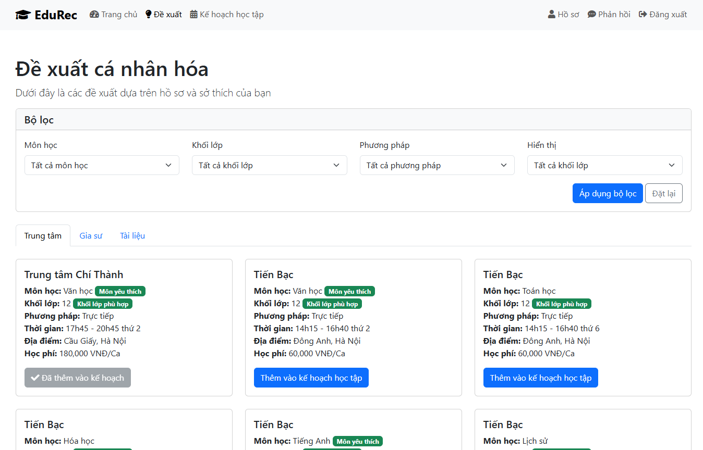

# Hệ thống Gợi ý EduRec

## 1. Cài đặt môi trường

- Yêu cầu Python >= 3.8
- Cài đặt các package cần thiết:

```bash
pip install -r requirements.txt
```

**Lưu ý:**
- Cần cài đặt MySQL server nếu muốn sử dụng database thật (hoặc có thể dùng SQLite để thử nghiệm).
- Đảm bảo các file dữ liệu đầu vào (CSV) nằm trong thư mục `data/`:
  - `data/hoc_sinh.csv`
  - `data/trung_tam.csv`
  - `data/gia_su.csv`
  - `data/tai_lieu.csv`

## 2. Huấn luyện mô hình đề xuất

Chạy script huấn luyện:

```bash
python train_model.py
```

- Script sẽ tự động tải dữ liệu, tiền xử lý, huấn luyện mô hình và lưu checkpoint vào thư mục `checkpoints/`.
- Kết quả huấn luyện và báo cáo hiệu năng sẽ được lưu vào file `performance_report.txt` trong thư mục checkpoint.
- Có thể điều chỉnh các tham số huấn luyện trong file `train_model.py`.

## 3. Khởi động website Flask

Chạy ứng dụng web:

```bash
python app.py
```

- Ứng dụng sẽ tự động tải mô hình đã huấn luyện từ checkpoint.
- Truy cập trang web tại địa chỉ: http://localhost:5000
- Đăng ký tài khoản, cập nhật hồ sơ, và sử dụng các tính năng gợi ý, lập kế hoạch học tập, quản lý lịch học.

## 4. Cấu trúc thư mục models/recommenders

```
models/recommenders/
├── __init__.py              # Khởi tạo package
├── utils.py                 # Tiện ích xử lý dữ liệu
├── metrics.py               # Định nghĩa các metric đánh giá
├── student_model.py         # Mô hình embedding học sinh
├── course_model.py          # Mô hình embedding trung tâm
├── tutor_model.py           # Mô hình embedding gia sư
├── material_model.py        # Mô hình embedding tài liệu
├── recommendation_model.py  # Mô hình tổng hợp đề xuất
├── train.py                 # Script huấn luyện (nếu dùng cấu trúc mới)
├── predict.py               # Script dự đoán/inference
```

## 5. Lưu ý về dữ liệu đầu vào
- Các file CSV phải đúng định dạng, mã hóa UTF-8.
- Nếu có lỗi về cột hoặc dữ liệu, kiểm tra lại tên cột và giá trị null.

## 6. Kiểm tra kết quả và sử dụng mô hình
- Sau khi huấn luyện, mô hình sẽ tự động được nạp khi chạy web.
- Có thể kiểm tra các file checkpoint, báo cáo hiệu năng, và sử dụng script `predict.py` để kiểm thử dự đoán offline.

## 7. Liên hệ & Đóng góp
- Nếu có vấn đề hoặc muốn đóng góp, vui lòng tạo issue hoặc pull request trên repository này. 

